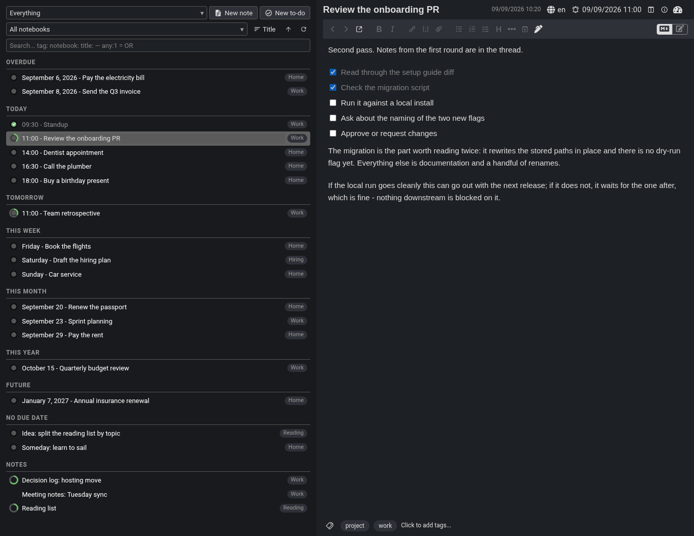
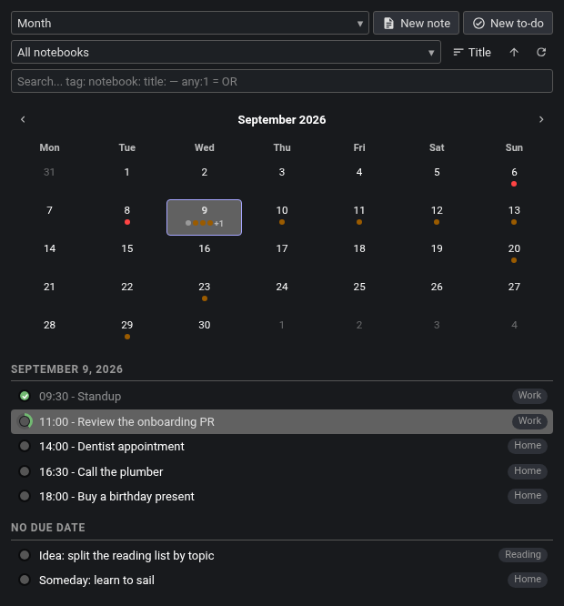
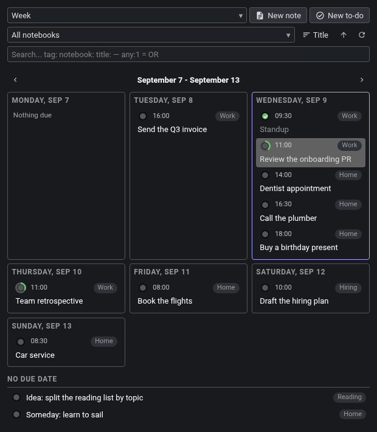
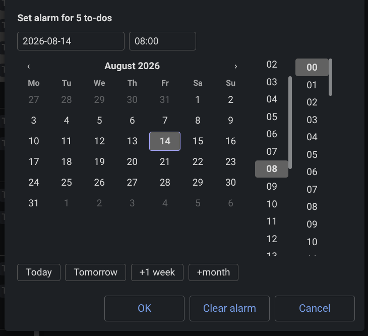
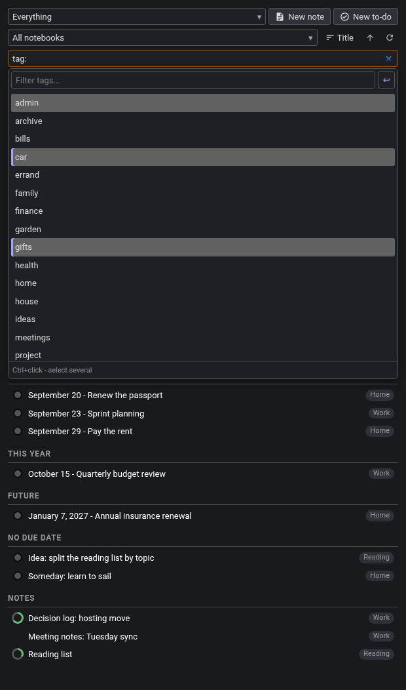
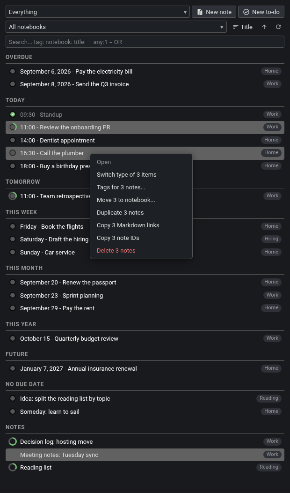
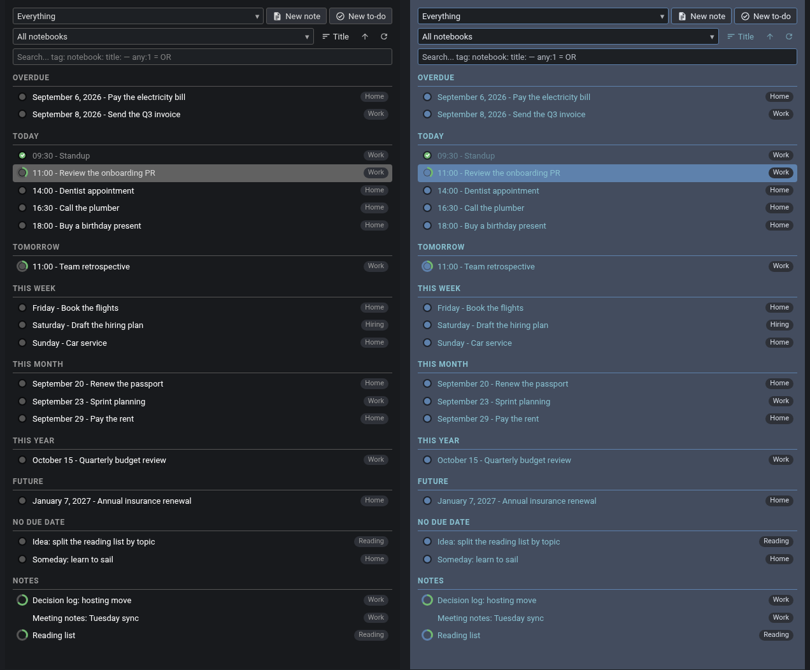

# Cockpit — a Joplin plugin

One panel for your to-dos, notes, and the checkboxes inside them, grouped by when they are due.

Cockpit is a single [Joplin](https://joplinapp.org) panel built to replace the notes and notebooks sidebars. It gathers every to-do, every note, and the checkboxes inside them into one view, grouped by due date — so it is your plan and your whole archive at the same time. Switch it between an Overdue / Today / This Week rundown, a flat list with one heading per day, a plain ungrouped roll-up, a month calendar, or a week planner. It is built for one thing: deciding what to do right now.



*One panel: every to-do and note grouped by due date, a progress ring on each row counting the checkboxes inside it.*

<!-- hero-panel.png: the whole Joplin window at 1360x1080 - NOT the full 1920 the other shots are
     staged in. GitHub scales a README image to about 890px wide, so a 1920px window renders the
     panel around 290px and its row text turns to mush; at 1360 the panel is 46% of the frame and
     the open note still shows its title, toolbar and whole checklist. Not narrower than 1360: the
     note title bar carries the due date, language chip, alarm and three icons on the same line, and
     below about 1300 Joplin ellipsises the title itself. Joplin's Dark theme, Cockpit's
     theme left on "Match Joplin theme". Joplin's own notebook sidebar and note list hidden (Cockpit
     replaces them), Cockpit docked on the left, a to-do open in the editor. The panel shows the interval
     view with Overdue / Today / Tomorrow / This Week / This Month / This Year / Future / No Due
     Date / Notes groups, the three header rows (profile picker + New note/New to-do, notebook
     filter + sort + sync, search field), notebook pills on rows, one greyed completed to-do, and
     partly-filled progress rings including on the row whose note is open in the editor — with that
     note's checkboxes visible beside it so the ring and the ticks match. Completed to-dos setting:
     "Grayed out". -->

One screen gives you the whole picture. A profile is a whole saved view — its format, filters, search and sorting — so switching profiles switches everything in one step. Narrow the list by notebook, or by anything Joplin's own search understands. Reschedule by dragging a to-do onto a day, or open the date picker for an exact time. The same file runs on Android.

[Views](#views) · [Due dates](#due-dates) · [Search and filtering](#search-and-filtering) · [Selecting rows](#selecting-rows-and-the-row-menu) · [Profiles](#profiles) · [Appearance](#appearance) · [Settings](#settings) · [On Android](#on-android)

## Install

In Joplin, open Settings (Configuration on Android) → Plugins, search for "Cockpit", and click Install. This works on both desktop and Android.

To install the file by hand instead, download `io.github.pmslava.cockpit.jpl` from the [releases page](https://github.com/pmslava/joplin-plugin-cockpit/releases) and use Plugins → Install from file; both platforms use the same file.

Cockpit needs Joplin 2.9 or newer on desktop and 3.3 or newer on mobile.

## Views

**Interval** is the default. It sorts everything into named horizons — Overdue, Today, Tomorrow, This Week, This Month, This Year, Future, No Due Date — and labels each row with just as much date as its group needs: a time under Today, a weekday under This Week, a full date under Overdue.

**Date** gives one heading per calendar day, each row prefixed with its due time. **Basic** does no grouping at all: a single list of titles, for a profile that wants a plain roll-up rather than a schedule.

**Month** draws a calendar with a coloured dot per to-do on each day — done, due or overdue — capped per profile with a "+N" overflow so a busy day cannot distort the grid. Every cell carries a screen-reader label naming the day, its count and how many are outstanding. Click a day to list it beneath the grid as ordinary tickable rows; click it again to close.



*The month calendar: a dot per to-do, done, due or overdue, with the picked day listed underneath.*

<!-- month-calendar.png: the panel iframe under a "Month" profile, Joplin Dark + Match Joplin.
     Monday-first grid for the current month, dots on at least eight days including one muted grey
     "done" dot and red dots on past days, one day carrying a "+N" overflow, today's cell outlined,
     and a day selected so the "calendar-selected" section lists that day's to-dos as tickable rows
     beneath the grid, with a "No Due Date" section under them. The three header rows must be in
     frame with the profile picker reading "Month". Note: a day whose to-dos are all completed
     draws a MUTED dot, not a green one — panel.css paints .calendar-dot.-done with
     --cockpit-color-faded. -->

**Week** gives one section per day, each to-do a card carrying its due time and notebook on the head line and the title below.



*The week planner: one section per day, each to-do a card with its due time and notebook.*

<!-- week-planner.png: the panel iframe under a "Week" profile, Joplin Dark + Match Joplin. At
     least five of the seven day sections populated, today's section outlined, each card showing the
     due time and the notebook pill on its head line with the title below, at least one "Nothing
     due" day for contrast, and the "No Due Date" section visible at the foot. One row may carry the
     editor-tracking highlight (the note open in the editor); no multi-row selection. -->

Both calendar views keep undated to-dos in their own "No Due Date" section beneath, so a calendar never silently drops them. Arrows step a month or a week, and clicking the title returns to today; where you navigated to lasts for the session and is not written into the profile.

Regular notes appear in their own "Notes" group, before or after the to-dos, per profile. Dates, weekdays and times are rendered in your own locale, and each profile chooses the shape: year 2022 or 22, month January / Jan / J / 01, day 9 or 09, weekday Monday / Mon / M, and 24-hour or AM/PM.

## Due dates

On desktop, drag a to-do onto a calendar day, a week-planner day or a list heading to reschedule it. Onto Today or Tomorrow it becomes due that day; onto This Week, This Month or This Year it becomes due by the end of that period; onto No Due Date its alarm is cleared. Drop into the gap *between* two rows and it lands midway between its new neighbours; drop several and the interval is divided into equal shares in the order you dragged them. That works at a group's edges too, including inside Overdue. While you are dragging, holding the pointer near the top or bottom edge of the list scrolls it, so a heading or a day that is off screen can be reached without letting go. A to-do dragged onto a bare day gets the day start time, 09:00 unless you change it.

For an exact time there is the picker: a YYYY-MM-DD date field, an HH:MM time field, and a month grid starting on the profile's first day of the week, with scrolling hour and minute columns pinned flush with it. Two rows of buttons sit above. The first is absolute — Today, Tomorrow, Weekends (the nearest Saturday), Next Monday. The second accumulates as you press it: +hour, +day, +week, +month(day) for the same weekday next month, +month(date) for the same day-of-month, clamped.



*The date picker with three to-dos selected: quick buttons above, calendar and time columns below, and the line that says what the two modes will do.*

<!-- alarm-picker.png: the desktop dialog opened by right-clicking the circle of a row inside a
     three-row selection, so the title reads "Set alarm for 3 to-dos". Must show: the ISO date and
     HH:MM fields; BOTH quick rows above the calendar (Today / Tomorrow / Weekends / Next Monday,
     then +hour / +day / +week / +month(day) / +month(date)); the Monday-first month grid with the
     hour and minute columns pinned flush to its bottom edge; the two mode radios ("Keep each
     to-do's own schedule" selected, "Same date & time for all"); the explanation line under them;
     and Joplin's own OK / Clear alarm / Cancel footer. Clip from the window's left edge so the
     panel is visible behind the dialog with the selected rows still lit. Joplin Dark. -->

With several to-dos selected the picker offers "Keep each to-do's own schedule" — the default, where every to-do shifts from its own time — or "Same date & time for all", and a line above the footer spells out what will happen. "Clear alarm" removes the due date from every selected to-do.

Right-click a to-do's circle, or long-press it on touch, to open the picker for that to-do, or for the whole selection if it is part of one. Right-click a group heading — "Today", "No Due Date", a week-planner day — to select everything under it and open the picker for the lot.

## The circle on every row

The circle on each row doubles as a ring showing how many of the checkboxes inside that note are ticked, with a "3/7 checkboxes done" tooltip. It is display-only in both directions: filling the ring does not complete the to-do, and completing the to-do does not fill the ring. A note with no checkboxes inside shows a plain disc instead.

Regular notes carry the same ring when they hold checkboxes — with nothing to tick, since a note has no due date and no completion — and no circle at all when they do not. Clicking a to-do's circle completes or un-completes it, and the panel shows the new state at once rather than waiting for Joplin's search index; a failed write rolls back.

The circle is 16 to 36 px, set in the settings; the ring keeps a constant fine weight at any size.

## Search and filtering

The search field takes anything Joplin's search takes — words, `tag:`, `notebook:`, `title:`, negations — applied on top of the profile's own criteria and committed with Enter. Start a query with `any:1` to match any term instead of all; the profile's own filters still apply on top. Emptying the field restores the unfiltered view by itself, however it was emptied.

Typing `tag:`, `notebook:` or `title:` opens a list of matching values — tags and notebooks from data the panel already carries, note titles fetched as you type — and picking one inserts it, leaving the rest of the query byte-for-byte untouched.



*Typing `tag:` opens the value list: filter it, mark several with Ctrl+click, and the apply button inserts them together.*

<!-- search-autocomplete.png: the panel iframe with "tag:" typed in the search field and the
     suggestion list open below it — the sticky "Filter tags..." box at the top with the apply
     button beside it, about fifteen tag rows with the last one sliced by the list's scroll height
     and a scrollbar beside it, two rows carrying the -marked style (lighter fill plus a left accent
     bar) so the apply button is shown, and the muted "Ctrl+click - select several" hint pinned at
     the foot. Panel rows must be visible below the list and the header rows above it, so it plainly
     sits inside the panel. Joplin Dark + Match Joplin. -->

The list is about fifteen rows tall and scrolls, with its own filter box pinned above it. Mark several values — Ctrl/Cmd+click on desktop, a 500 ms press-and-hold then plain taps on touch — and an apply button inserts them together. Marks are held by value, so narrowing the list or clearing the filter never loses them, and Escape unwinds one step at a time: marks, then filter text, then the list.

When a search matches nothing inside the current filters, Cockpit runs one unfiltered search and shows up to fifteen hits under "Results outside current filters". Those rows open on a click but cannot be selected, dragged or acted on in bulk. Only if that is also empty does it look inside the notebooks you have excluded, under "Results in excluded notebooks". Only when both come up empty does it say there are no matches anywhere.

Excluded notebooks are named in the settings, and are hidden from Cockpit everywhere — search results, panel rows, checkbox counts, the overview notes and the notebook picker — sub-notebooks included. Entries are resolved to notebook ids and tracked by id, so renaming or moving an excluded notebook keeps the exclusion working, and a Parent/Sub path disambiguates notebooks that share a name.

The notebook dropdown lists every notebook by its full path, with a filter box pinned at the top; typing narrows it and Enter picks the first match. It offers every notebook, not only the ones the current to-dos live in. Every row also carries the notebook it lives in: click that pill to filter to it, right-click it to move the note somewhere else, hover it for the full path.

A sort picker decides how items sharing a due time — and the Notes group — are ordered: by title (natural, case-insensitive), by updated or by created date, ascending or descending. The choice is part of the profile.

## Selecting rows, and the row menu

On desktop, Ctrl+click adds a row and Shift+click takes a range. A selection can mix to-dos and regular notes freely — a to-do is a note, so every batch action applies to both. With several rows selected, Escape leaves exactly one selected, the last row you actually selected, rather than clearing the lot; and it reaches the selection only when nothing else is open, since a menu, dropdown or suggestion list wins Escape first.

Right-clicking a row opens Cockpit's own menu: Open, Switch between note and to-do type, Tags…, Move to notebook…, Duplicate, Copy Markdown link, Copy note ID, Delete note. The same menu opens on a long press on mobile.



*Three rows selected — two to-dos and a note — and every entry in the menu says how many it will act on.*

<!-- row-menu-multi.png: the panel iframe with three rows selected by Ctrl+click, at least one of
     them from the Notes group, and Cockpit's own #noteContextMenu open over the upper half of the
     panel so nothing is clipped. The menu must legibly read: Open (greyed), "Switch type of 3
     items", "Tags for 3 notes...", "Move 3 to notebook...", "Duplicate 3 notes", "Copy 3 Markdown
     links", "Copy 3 note IDs", "Delete 3 notes" (in red). The three selected rows must be visibly
     highlighted behind it. Joplin Dark + Match Joplin. -->

Right-click inside a multi-row selection and every capable entry is retitled with the count — "Delete 6 notes", "Switch type of 3 items", "Copy 4 Markdown links" — so a mistaken batch is visible before the click; the single-only Open greys out rather than disappearing. Dragging a mixed selection onto a date, dropping it between rows or setting an alarm on it applies to the to-dos in it, in selection order; the notes ride along and are left out of anything time-based.

Copy Markdown link and Copy note ID copy one per line for a selection, with square brackets in titles escaped exactly as Joplin does. If a runtime has no clipboard the panel says so in its own toast rather than a blocking dialog.

Any click on a row opens the note in the main editor; double-clicking its title opens it in its own Joplin window, on desktop. Whichever note the editor is showing is highlighted in the panel, however it was opened — from a Cockpit row, the note list or a link — and that highlight never joins a drag or a batch action. A text selection dragged out of the note editor keeps extending across the panel instead of stopping at its edge.

## Profiles

A profile stores the display format, the search criteria, which completed to-dos count, whether notes are listed and where, the notebook filter, the panel search text and the sorting — so switching profiles switches the whole view in one step.

- Four independent switches decide whether completed to-dos from the past, from today, from the future and with no due date are shown, so a profile can keep today's ticked-off work visible while hiding last month's.
- A profile also chooses whether undated to-dos are listed at all and whether they are pushed to the end; whether the week starts on Monday or Sunday, which also sets where "This Week" ends; how many dots a calendar day shows before it collapses into "+N", from 1 to 10; and the date, weekday and 12-versus-24-hour formats.
- The dropdown lists every profile with its own always-visible edit and delete buttons and a "+ New profile…" entry — no hover needed, so it works by tap on mobile too. A numeric sort order decides the order, ties falling back to the name.
- A fresh install starts with an "All todo and notes" profile showing everything, and the last remaining profile cannot be deleted.

## Notebooks and notes

Every row of the notebook dropdown carries rename, move-under-another-notebook and delete buttons, and a "+ New notebook…" entry sits at the bottom. Deleting asks first and moves the notebook and its notes to the trash.

New note and New to-do create in the notebook the panel is filtered to and open it; with "All notebooks" selected they ask which notebook first. Joplin's own "when creating a new note" title-or-body preference is honoured.

Move, tag and duplicate run Joplin's own dialogs on desktop — the native tag dialog with its autocomplete and common-tags behaviour, Joplin's move dialog, Joplin's duplicateNote. On mobile Cockpit does each itself: a notebook picker it draws, a comma-separated tag field prefilled with the note's current tags (attaching and detaching exactly the difference), and a field-by-field copy into a fresh note in the same notebook.

## Overview notes

Give a profile the id of a note and Cockpit keeps that note filled with the profile's list as Markdown — a heading per group, each to-do a checkbox linked back to itself — so the plan is readable in any Joplin client, including ones that cannot show the panel.

It is rewritten only when the content actually differs, so an unchanged list does not create a note revision on every refresh, and Cockpit ignores its own writes rather than looping on them. A month or week profile writes the date-grouped list rather than a grid, which stays readable and clickable in a note.

## Sync, and keeping up

A button in the header starts a sync — or cancels one in progress — and spins while it runs. Its tooltip reports when the last sync finished, how long it took and whether it had errors; on mobile a long press shows that as a toast, since touch has no hover. Sync start and completion repaint the panel immediately, and one bounded catch-up pass follows so items a sync pulled in appear without waiting for the periodic refresh.

Ticking a to-do, creating one, switching an item between note and to-do, or a change made elsewhere in Joplin all appear in the panel at once.

A profile switch draws the list first and fills the progress rings in behind it, nearest the top of the view first, so a long list is usable before every ring is counted. A background refresh leaves the list where you left it; only a deliberate change of view returns it to the top.

## Appearance

By default the panel takes its colours from the live Joplin theme. It can instead be pinned to Light, Dark, Solarized Light, Solarized Dark, Nord, Aritim Dark or OLED Dark — the Cockpit panel only, not the rest of Joplin.



*The same list, same Joplin, two Cockpit themes: Match Joplin on the left, Nord on the right. Seven presets ship in all, plus six custom colour fields.*

<!-- themes.png: TWO real panel-iframe captures of the SAME staged list, side by side in the same
     order as the caption, made by changing only Settings › Plugins › Cockpit › "Cockpit panel
     theme" between them: Match Joplin theme, then Preset — Nord. Joplin itself stays on its Dark
     theme throughout, which is the point — the panel changes and the app does not.
     TWO, not three: the montage is 636px per panel, GitHub scales a README image to about 890px,
     and a third panel drops each to ~290px where the row text stops being readable.
     Nord is the right partner for Match Joplin and a light preset is NOT available: the panel takes
     its background from Joplin's backgroundColor2 — the SIDEBAR colour, since Cockpit replaces the
     sidebar — and all seven presets are dark there (light #313640, solarizedLight #002b36, nord
     #434c5e, solarizedDark #073642, dark/oledDark #181A1D, aritimDark #141a21). "Preset — Solarized
     Light" therefore draws a dark teal panel. Nord's #434c5e is the furthest any preset gets from
     Joplin's own dark. A genuinely light panel needs Custom mode.
     Each capture must include the three header rows and at
     least one greyed completed to-do so the completed-to-do style reads, identical content row for
     row and identical heights, scrolled to the top. Composed with a thin neutral gutter and no
     added labels, borders or shadows. Do NOT reuse the old settings-pane screenshot: it showed no
     panel and leaked an unrelated plugin list. -->

A Custom mode exposes six colour fields — text, panel background, menu/popup background, to-do checkbox, progress-ring fill and divider — each taking any CSS colour, with anything left empty still following the Joplin theme.

A completed to-do's title can stay normal, or be greyed out, struck through, or both. The panel's base font size can be pinned between 1 and 32 px, or left at 0 to follow Joplin's, and the to-do circle set between 16 and 36 px. On desktop, Tools › Cockpit › Set Panel CSS opens an editor for CSS applied to the panel, injected after the theme so it always wins.

## Settings

Cockpit's settings live in Joplin's own Settings › Plugins › Cockpit.

- **Panel refresh interval** — how long Cockpit waits between background refreshes of the panel and the overview notes. 60 seconds by default on desktop, raised on mobile unless you set it yourself.
- **Day start time** — the time a to-do gets when it is dragged onto a day it has no time of its own for. 09:00 by default.
- **Excluded notebooks** — see [Search and filtering](#search-and-filtering).
- **Theme, completed-to-do style, font size, circle size and the six custom colours** — see [Appearance](#appearance).
- **Show the Cockpit button in the note toolbar** — a gauge button in the note toolbar toggles the panel, and the same command sits in Tools › Cockpit alongside this switch and Set Panel CSS. Joplin cannot add or remove a toolbar button while running, so turning it on or off applies after a restart, and Cockpit says so.
- **Gesture trace** — a default-off, mobile-only diagnostic that replaces the suggestion list's hint line with the last few touch events, so a touch problem on a real device can be reported precisely.

## On Android

One .jpl serves both platforms; it detects the platform at runtime. On mobile Cockpit is a tab inside Joplin's own plugin-panel screen and uses Joplin's own button rather than a toolbar button of its own.

Every picker — the notebook picker, the tag editor, the date picker, the whole profile editor — is drawn as a touch overlay inside the panel itself, because a plugin dialog on Android is always drawn behind the panel. A half-second press on a row, a group heading or a to-do's circle opens the same menus a desktop right-click does, and to-do rows gain an explicit "Move to date…" entry since an 18 px circle is a hard touch target. Rows get roughly 40 px hit areas, and the create buttons drop to icons so the header can give its width to the profile picker.

Android can restart the panel's webview under load, so Cockpit keeps the scroll position, an open picker and an in-progress search — the typed query, the open dropdown and its marks — on the plugin side and rebuilds them.

Desktop-only: drag-and-drop rescheduling, Ctrl/Shift multi-select and the batch actions that follow from it, double-click to open in a new window, custom panel CSS, and the note-toolbar button.

## Build from source

```
npm install
npm run dist
```

The build writes `publish/io.github.pmslava.cockpit.jpl`. The same file serves both platforms.

## Upgrading from earlier versions

Profiles from the older sqlite3 database — including the one under the plugin id Cockpit used to be published under, as Agenda — and custom CSS from the old custom.css file are imported once into plugin settings, leaving the originals untouched. Profiles saved before the completed-period switches existed inherit their old all-or-nothing setting. The import runs on desktop only; the settings themselves are stored the same way on both platforms.

## Credits

Cockpit began as a fork of [Agenda](https://github.com/TheScriptingGuy/Joplin-Agenda-Plugin) by BeatLink and TheScriptingGuy (MIT). The panel, dialogs, and most behaviour have since been reworked, but the profile system and overview notes trace back to their work. The idea of aggregating all your scattered work into one live view came from the [Inline Tag Navigator](https://github.com/alondmnt/joplin-plugin-tag-navigator) plugin by alondmnt, though Cockpit built it on Joplin's core to-do functionality rather than inline tag syntax.

## License

MIT. See [LICENSE](LICENSE).
